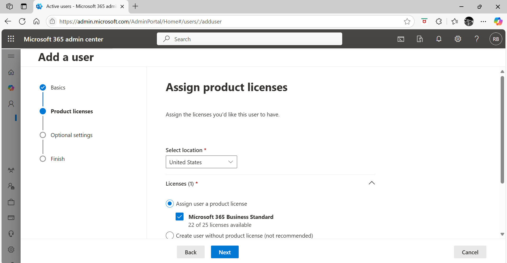
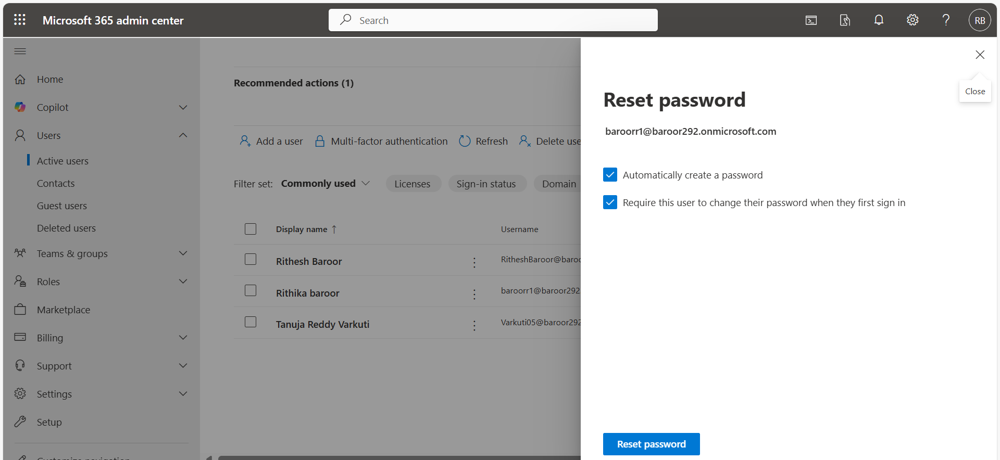
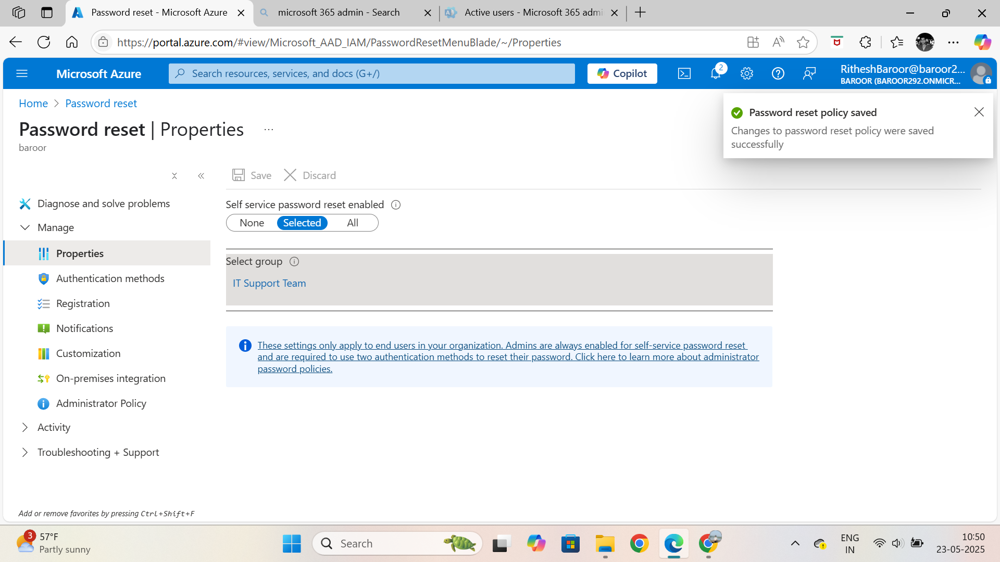
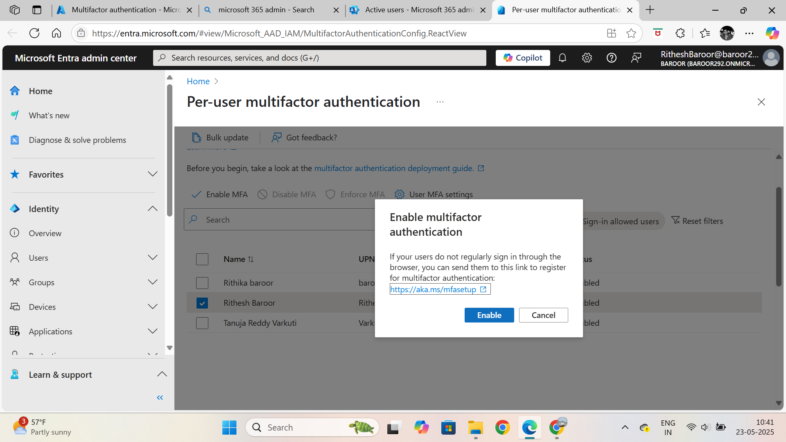
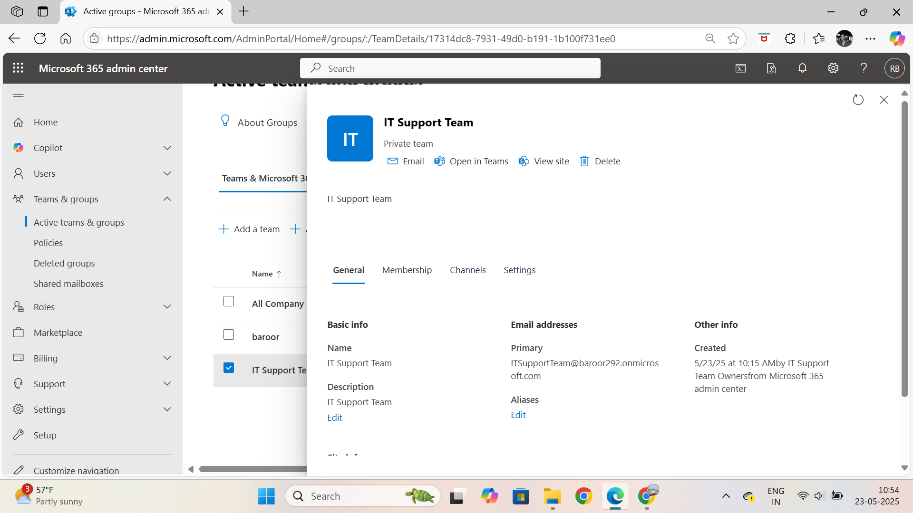
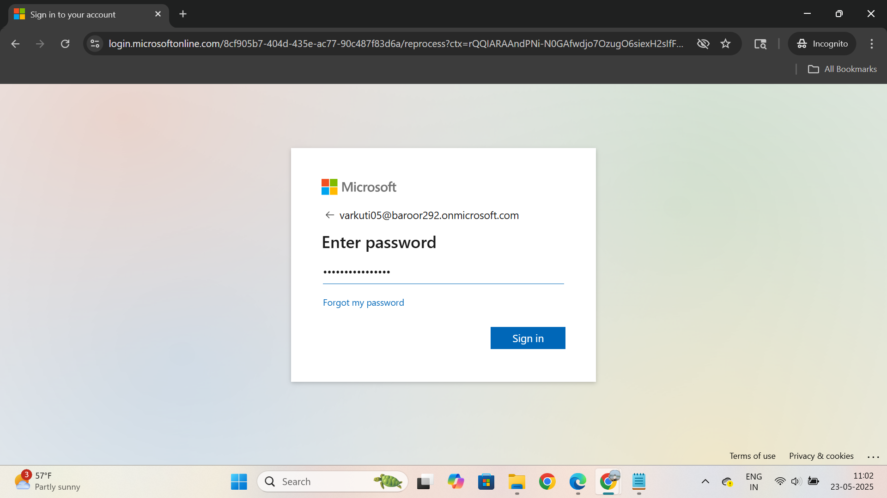
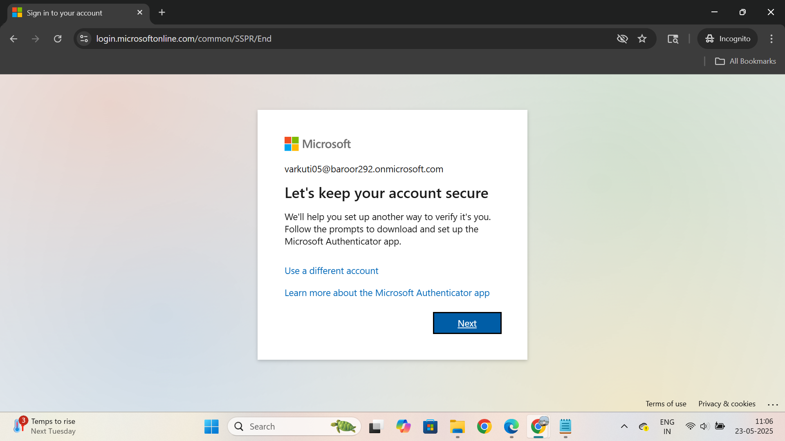
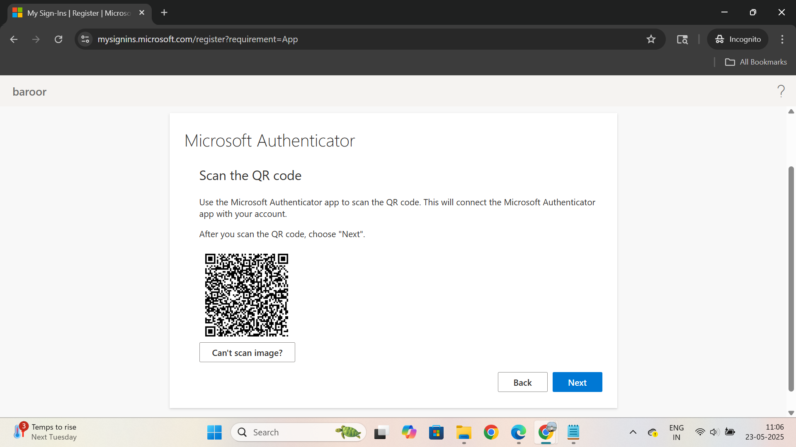

# 🛠️ Microsoft 365 Admin Center Simulation Lab

This repository documents a Microsoft 365 Admin Lab, showcasing practical experience with user and group management, license assignment, and security features using the Microsoft 365 Admin Center and Azure Active Directory (Azure AD).

---

## ✅ Step-by-Step Tasks and Screenshots

### 1. **User Creation**
Navigate to **Admin Center → Users → Active Users → Add User**, fill in the required details, and create a new user.


---

### 2. **License Assignment**
Open the newly created user’s profile and assign the **Microsoft 365 E5** license under **Licenses and Apps**.



---

### 3. **Password Reset**
Select the user, click **Reset Password**, and choose to auto-generate or manually set a password.



---

### 4. **Password Policy Configuration**
Go to **Azure AD → Users → Password Reset**, configure expiration rules, and set notification periods.



---

### 5. **Multi-Factor Authentication Setup**
Access **Azure AD → Users → Multi-Factor Authentication**, enable MFA for the user, and guide them through the first login process.



---

### 6. **Security Group Creation**
In the Admin Center, go to **Groups → Active Groups → Add Group**, select “Security,” and add members.



---

### 7. **Login Test with MFA**
Login as the test user in a private browser to validate MFA setup.

- **Screenshot 1:** User enters password  
  

- **Screenshot 2:** Account setup 
  

- **Screenshot 3:** Setup of Microsoft Authenticator
  

---

## 👤 Users Created

- **Rithesh Baroor** — `RitheshBaroor@baroor292.onmicrosoft.com`  
- **Rithika Baroor** — `baroorr1@baroor292.onmicrosoft.com`  
- **Tanuja Reddy Varkuti** — `Varkuti05@baroor292.onmicrosoft.com`

---

## 📂 Folder Structure

```
m365-admin-lab/
├── screenshots/
│   ├── user_creation.png
│   ├── license_assignment.png
│   ├── password_reset.png
│   ├── password_policy.png
│   ├── MFA_setup.png
│   ├── group_creation.png
│   ├── user_login_test1.png
│   ├── user_login_test2.png
│   └── user_login_test3.png
├── tasks/
│   └── task_log.md
└── README.md
```

---

## 🎯 Skills Demonstrated

- Microsoft 365 user lifecycle management  
- License assignment and product configuration  
- Password security and policy enforcement  
- Multi-Factor Authentication (MFA) setup  
- Security group configuration and access control  

---

## 📎 How to Use

- Use this as a practice lab for Microsoft 365 Admin tasks  
- Review each step and try replicating in your own dev tenant  
- Follow the screenshots and explanations for clear guidance  

---

## 📘 License

This project is open source and intended for learning, certification prep, and portfolio development.
